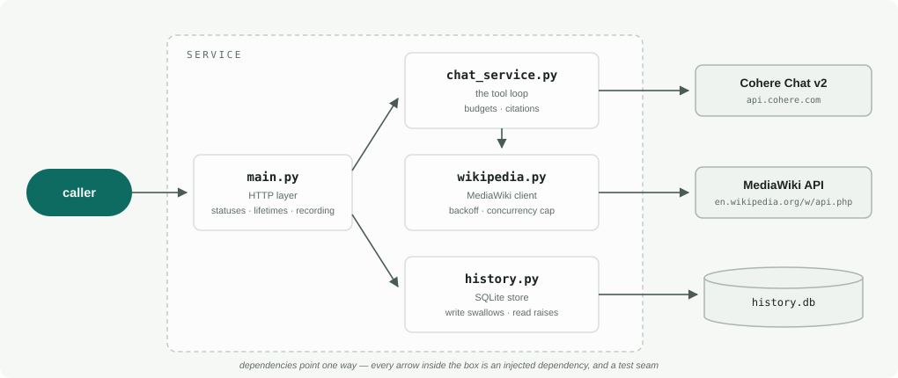

# Architecture

How the pieces fit, what bounds the work, and where to look first. The
[README](README.md) says what the service does and why each behaviour is the
way it is; the [engineering log](ENGINEERING_LOG.md) records the decisions in
the order they were made. This file is the map.

## The shape

Dependencies point one way: `main.py` knows about everything, nothing knows
about `main.py`. Each internal arrow is an injected dependency and therefore a
test seam — the offline suite swaps `FakeCohereClient` in for the SDK and a
`MockTransport` in for MediaWiki, and the same seams are why task 3's store
dropped in without moving anything else.

The boundaries carry the error policy too. Each client owns its upstream's
failure modes and translates them into one exception type (`ChatError`,
`WikipediaError`) that carries what the layer above needs — status, retry
hints — and never the upstream's response body. `main.py` maps those onto
HTTP statuses from a fixed table; bodies and transport strings go to the log,
truncated and flattened.

## One /chat request

Three details the diagram can't show:

* **Every `tool_call_id` gets a tool message back**, including calls we refuse
  to run — Cohere rejects the next request otherwise. A refused call's message
  says why, so the model answers from what it has instead of retrying.
* **When the budgets run out, the next call withholds the tool** rather than
  refusing the model's request after the fact. `tool_choice: "NONE"` is the
  documented way to do this and this model returns 400 for it — found by the
  live contract tests, not the mocks.
* **Citations are rebased.** v2 returns content as blocks and cites offsets
  within a block; the caller gets one joined string, so offsets are shifted
  onto it and `response[start:end] == text` is held as an invariant. Citations
  against reasoning blocks, or spans that die in whitespace stripping, are
  dropped rather than returned pointing at the wrong words.

## Everything that bounds the work

The loop runs against someone else's metered API on one side and a shared
public one on the other, so every axis has a ceiling. Per-round caps multiply
rather than bound, which is why the whole-request budgets exist.

| Knob | Default | What it bounds |
| --- | --- | --- |
| `REQUEST_TIMEOUT_SECONDS` | 30 | one Cohere call |
| `MAX_RETRIES` | 1 | SDK retries per call (its own default is 2 tries at 300s) |
| `MAX_OUTPUT_TOKENS` | 4096 | one generation, thinking included |
| `MAX_TOOL_ROUNDS` | 4 | rounds of searching per request |
| `MAX_TOOL_CALLS_PER_ROUND` | 4 | searches one model response may ask for |
| `MAX_TOTAL_SEARCHES` | 8 | searches per request, however spread across rounds |
| `TOOL_LOOP_SECONDS` | 45 | whole-request wall clock, enforced as a hard 504 |
| — soft deadline | derived | reserves `min(request_timeout, half the window)` so the final answering call has time to run |
| `WIKIPEDIA_TIMEOUT_SECONDS` | 10 | one MediaWiki call |
| `WIKIPEDIA_MAX_RESULTS` | 5 | hits per search |
| `WIKIPEDIA_EXTRACT_CHARS` | 1200 | one extract, capped at TextExtracts' own `exchars` ceiling |
| `MAX_CONCURRENCY` (constant) | 3 | Wikipedia requests in flight, per Wikimedia's etiquette |
| `MAX_BACKOFF` (constant) | 300s | longest `Retry-After` honoured, so one broken header can't wedge the tool |
| `/history` `limit` | 1–200 | one history page |

Context size is bounded statically rather than at runtime — a result's size
isn't known until fetched, so the bound is
`MAX_TOTAL_SEARCHES × WIKIPEDIA_MAX_RESULTS × WIKIPEDIA_EXTRACT_CHARS`,
about 48K characters at the defaults.

## A reviewer's map

| To see | Read |
| --- | --- |
| The loop itself — rounds, refusals, withdrawal | `chat_service.ChatService._loop` |
| The budget and the answering-call reserve | `chat_service.Budget` |
| Citation rebasing, including the whitespace edge | `chat_service._flatten`, `_extract_citations` |
| The schema wording that decides whether the model searches | `wikipedia.WIKIPEDIA_TOOL` |
| Backoff that's enforced, not just reported | `wikipedia.WikipediaClient._request`, `_retry_seconds` |
| The store, and the write/read failure asymmetry | `history.HistoryStore` |
| The fakes behind the offline suite | `tests/conftest.FakeCohereClient` |
| Assumptions checked against the real APIs | `tests/test_live_contract.py` |

## Decisions that shaped it

Each argued in full where it lives; one line each here.

1. **Extracts, not just snippets.** `list=search` snippets often don't contain
   the answer — the README has the Buzz Lightyear experiment — so
   `prop=extracts` attaches each article's opening paragraphs.
2. **Withhold the tool instead of `tool_choice: "NONE"`** — the documented
   parameter 400s on this model, which only a live call could reveal.
3. **Two budget layers**, because per-round caps multiply: whole-request
   search and wall-clock ceilings, with time reserved for the final answer.
4. **Bodies to logs, fixed strings to callers** — provider diagnostics can
   name orgs, models and hosts, and log lines are truncated and flattened so a
   crafted body can't forge entries.
5. **SQLite for history, recorded in `main.py`** — persistence isn't
   `ChatService`'s job; writes swallow failures because the answer already
   exists, reads raise because a silently empty history lies.
6. **Auth and rate limiting deliberately absent** — built once, then cut:
   wrong layer for this service, and the log keeps the history of that
   reversal.
